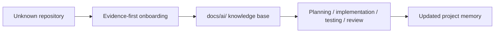

# AI Smart Superpowers for Onboarding

**Ein modulares Repository-Preflight-Framework fuer KI-Coding-Agenten.**

**Bereite Repositories vor, bevor KI-Coding-Agenten Code veraendern.**

This project turns repository evidence into a reviewed, validated and language-adaptive knowledge base with architecture, constraints, risks, project memory, security rules and review checklists before coding agents change files.

It is a modular Repository Preflight Framework for AI coding agents. It prepares repository-specific context; it is not a coding agent, not an SDK, not a runtime package and not a replacement for human review.

<p align="center">
  <a href="https://github.com/SametE42/AI-Smart-Superpowers-for-Onboarding/actions/workflows/validate.yml"></a>
  <a href="LICENSE"></a>
  
  
</p>

<p align="center">
  <a href="#overview">Overview</a> ·
  <a href="#target-output">Target Output</a> ·
  <a href="#quickstart">Quickstart</a> ·
  <a href="#where-this-fits">Where This Fits</a> ·
  <a href="#multilingual-ai-manual">Languages</a> ·
  <a href="templates/MASTER_PROMPT.en.md">Master Prompt</a> ·
  <a href="https://github.com/SametE42/AI-Smart-Superpowers-for-Onboarding/issues">Issues</a>
</p>

---

## Start Here

<table>
  <tr>
    <td width="25%"><a href="templates/MASTER_PROMPT.en.md"><strong>Master Prompt</strong></a><br>Primary English onboarding prompt.</td>
    <td width="25%"><a href="templates/docs-ai/"><strong><code>docs/ai/</code> templates</strong></a><br>Target knowledge-base files.</td>
    <td width="25%"><a href="templates/MASTER_PROMPT.md"><strong>German Prompt</strong></a><br>German workflow prompt.</td>
    <td width="25%"><a href="ai/English/README.md"><strong>AI Manual</strong></a><br>Canonical operating manual.</td>
  </tr>
</table>

## Framework Snapshot

AI coding agents work best when they receive stable repository context, explicit boundaries and verifiable documentation instead of scattered files and guesses. This project exists to make that preparation repeatable, reviewable and portable across tools, languages and project stacks.

```text
AGENTS.md -> AI Smart Superpowers for Onboarding -> docs/ai/ or localized knowledge base -> Skills/Workflows -> Coding Agent -> Human Review
```

| Question | Short answer |
|---|---|
| What is it? | A modular repository-preflight framework for AI coding agents. |
| Why does it exist? | To turn repository evidence into reusable AI context before implementation work begins. |
| What problem does it solve? | It reduces assumption-driven coding by making architecture, build/test context, risks, constraints and review boundaries explicit. |
| What does it produce? | A canonical `docs/ai/` knowledge base or a localized equivalent selected through language-aware mappings. |
| Where does it fit? | Before coding-agent execution workflows, skills, multi-agent handoffs and human review. |

This project is not a coding agent, SDK or runtime package, and it does not replace human review. Python is only an internal automation option for installer, validation and tests.

The framework is technology-neutral. It is intended for Python, JavaScript, TypeScript, Java, C#, Go, Rust, PHP, Ruby, Kotlin, Swift, C/C++, monorepos, frontend, backend, fullstack, Infrastructure-as-Code and documentation repositories.

All existing languages are intended to reach the same functional output support level. English is the canonical reference language, but not the only complete output language. Translation quality is documented separately from functional support. AGENTS.md stays unchanged by default because many tools expect that entrypoint filename.

## Contents

[`Overview`](#overview) · [`Framework Modules`](#framework-modules) · [`Onboarding Modes`](#onboarding-modes) · [`Where This Fits`](#where-this-fits) · [`Target Output`](#target-output) · [`Quickstart`](#quickstart) · [`Languages`](#multilingual-ai-manual) · [`Validation`](#validation) · [`Security`](#security-model)

## Overview

AI coding agents work best when they receive stable repository context, explicit boundaries and verifiable documentation instead of scattered files and guesses. This repository provides a pre-development onboarding layer built around:

| Standard layer | What it gives you |
|---|---|
| **Evidence-first analysis** | Repository facts are gathered from files, tests, configuration and existing documentation. |
| **Persistent AI knowledge base** | The output is a reviewed `docs/ai/` folder that future AI sessions can load. |
| **Short tool entrypoints** | Files such as `AGENTS.md`, `CLAUDE.md`, `GEMINI.md` and Copilot instructions stay compact and point to `docs/ai/`. |
| **Safety and review boundaries** | Unknowns, assumptions, secrets, production claims and human-review gates stay explicit. |
| **Reusable onboarding prompt** | `templates/MASTER_PROMPT.en.md` guides the initial interview, repository pre-check and documentation plan. |

This is not a production app, backend service, SDK, runtime package or replacement for human review. It is a reusable standard for making AI-assisted repository work safer and easier to audit.

## Framework Modules

The repository is intentionally modular because AI-agent onboarding in complex repositories needs more than one instruction file. The framework separates tool entrypoints, persistent knowledge, stack context, build and test context, evidence tracking, governance, tool compatibility, validation, examples, translations and language-dependent output for every existing language.

| Module | Purpose | Start here |
|---|---|---|
| Core onboarding | Main process and master prompt | [`templates/MASTER_PROMPT.en.md`](templates/MASTER_PROMPT.en.md) |
| AI knowledge base | Persistent repository context | [`templates/docs-ai/`](templates/docs-ai/) |
| Tool entrypoints | Short tool-specific references to the knowledge base | [`templates/tool-entrypoints/`](templates/tool-entrypoints/) |
| Skill packaging | Portable repeatable workflows | [`skills/repo-onboarding/SKILL.md`](skills/repo-onboarding/SKILL.md) |
| Integration modes | Minimal, Standard and Enterprise adoption | [`docs/integration-modes.md`](docs/integration-modes.md) |
| Integration guide | Manual and installer-based setup | [`docs/how-to-integrate.md`](docs/how-to-integrate.md) |
| Localized output | Canonical or localized target files | [`docs/localized-output.md`](docs/localized-output.md) |
| Architecture | How this repository is organized | [`docs/architecture-of-this-project.md`](docs/architecture-of-this-project.md) |
| Localization quality | Review status and terminology rules | [`docs/localization-guidelines.md`](docs/localization-guidelines.md) |
| File-map schema | Language-specific output naming rules | [`docs/file-map-schema.md`](docs/file-map-schema.md) |
| Migration | Moving between old, canonical and localized structures | [`docs/migration-guide.md`](docs/migration-guide.md) |

## Onboarding Modes

The current templates define the reusable knowledge base. The installer is experimental but functional and supports three modes:

| Mode | Use when | Output shape |
|---|---|---|
| Minimal | Small projects or quick repository orientation | `AGENTS.md` plus 7 core knowledge-base files |
| Standard | Normal application or library repositories | `AGENTS.md` plus 17 architecture, stack, evidence and review files |
| Enterprise | Larger, regulated or security-sensitive repositories | Tool entrypoints plus 21 runtime, role, safety and human-review files |

The machine-readable contract for these modes is [`config/standard-docs.yml`](config/standard-docs.yml). Each mode can generate canonical English structures or localized structures through file maps. The actual language list is derived from repository evidence, not from hard-coded examples.

## Where This Fits

AI coding agents do better work when they follow structured workflows. But structured workflows depend on accurate project context.

This repository provides the preparation step before execution workflows begin: it turns repository evidence into a reviewed AI knowledge base before agents start coding work.

Use it before structured coding-agent workflows, Superpowers-style workflows or multi-model development setups. Superpowers-style workflows describe how an agent plans, implements, tests and reviews. This repository describes what an agent should know about a concrete repository before those workflows start.

`Superpowers-style` is used descriptively and does not imply compatibility, endorsement or integration with `obra/superpowers`.

## Target Output

The standard uses a layered output model:

| Layer | Meaning | File count |
|---|---|---|
| Conceptual Core | The 10-document mental model used by the master prompt and README overview. | 10 |
| Minimal | Installable lightweight contract for quick repository orientation. | 7 docs plus `AGENTS.md` |
| Standard | Installable default contract for normal repositories. | 17 docs plus `AGENTS.md` and manifest |
| Enterprise | Installable governance contract for regulated, security-sensitive or multi-agent repositories. | 21 docs plus tool entrypoints and manifest |
| Localized Output | Any installable mode rendered through a language file map. | Same mode count, localized folder and filenames where configured |

The conceptual core is the short view of the knowledge base:

```text
docs/ai/
├─ MASTER_SYSTEM.md
├─ ARCHITECTURE.md
├─ PROJECT_MEMORY.md
├─ STYLE_GUIDE.md
├─ REVIEW_CHECKLIST.md
├─ DOMAIN_KNOWLEDGE.md
├─ SECURITY_RULES.md
├─ ERROR_PATTERNS.md
├─ CHANGELOG_AI.md
└─ ONBOARDING.md
```

Key files:

| File | Purpose |
|---|---|
| `PROJECT_MEMORY.md` | Continuity, handover notes, open tasks, assumptions, decisions and next steps. |
| `ARCHITECTURE.md` | Evidence-based architecture observations, boundaries and constraints. |
| `SECURITY_RULES.md` | Security boundaries, risk notes, redaction rules and sensitive-data handling. |
| `REVIEW_CHECKLIST.md` | Human and AI review checkpoints before work is trusted. |
| `CHANGELOG_AI.md` | Log of AI-assisted documentation changes and rationale in the conceptual prompt model. |

Installer modes are stricter than the conceptual view. Minimal, Standard and Enterprise are validated against [`config/standard-docs.yml`](config/standard-docs.yml); localized output keeps the same mode semantics while using `i18n/file-map.<code>.yml` for the target folder and filenames.

## Quickstart

1. Open [`templates/MASTER_PROMPT.en.md`](templates/MASTER_PROMPT.en.md).
2. Give it to your coding agent.
3. Point the agent at the target repository.
4. Review the proposed documentation plan.
5. Approve creation or update of `docs/ai/`.
6. Use `docs/ai/` as context for future AI-agent sessions.

`templates/MASTER_PROMPT.en.md` is the primary English onboarding prompt. Use [`templates/MASTER_PROMPT.md`](templates/MASTER_PROMPT.md) when you specifically want the German workflow prompt.

```text
Primary prompt:  templates/MASTER_PROMPT.en.md
German prompt:   templates/MASTER_PROMPT.md
Target output:   docs/ai/
Installer:       python scripts/install_ai_onboarding.py --mode standard --language en --structure canonical
Local checks:    python -m unittest discover -s tests
                 python scripts/validate_repository.py --root .
```

No package installation is required to use the prompt standard. Python is only needed for this repository's maintenance checks.

## Workflow



## When To Use

- Before asking an AI agent to modify an unfamiliar repository.
- Before a larger AI-assisted feature.
- Before multiple AI tools work on the same codebase.
- When project knowledge is scattered across files, issues or prior conversations.
- When architecture assumptions must be explicit.
- When security, review boundaries and traceability matter.
- When future AI sessions need reusable project memory.

## When Not To Use

- When you only need a short explanation.
- When the repository is already fully documented and current.
- When you want immediate code changes without documentation or review.
- When generated AI documentation cannot be reviewed by a human.
- When sensitive data cannot be safely inspected or summarized.

## Multilingual AI Manual

<p>
  
  
</p>

<table>
  <tr>
    <td width="20%"><a href="ai/English/README.md"><strong>English</strong></a><br>Source of truth</td>
    <td width="20%"><a href="ai/German/README.md"><strong>German</strong></a><br>Localized mirror</td>
    <td width="20%"><a href="ai/LANGUAGE_INDEX.md"><strong>Language Index</strong></a><br>All 75 folders</td>
    <td width="20%"><a href="ai/TRANSLATION_POLICY.md"><strong>Translation Policy</strong></a><br>Rules and invariants</td>
    <td width="20%"><a href="ai/TRANSLATION_STATUS.md"><strong>Localization Status</strong></a><br>Coverage table</td>
  </tr>
</table>

The multilingual manual is organized under `ai/`. English is authoritative. Non-English folders mirror the English structure and carry a localization status marker whose review state is tracked in the language metadata.

<details>
<summary><strong>Browse all language mirrors</strong></summary>

|  |  |  |  |  |
|---|---|---|---|---|
| [Afrikaans](ai/Afrikaans/README.md) | [Albanian](ai/Albanian/README.md) | [Amharic](ai/Amharic/README.md) | [Arabic](ai/Arabic/README.md) | [Armenian](ai/Armenian/README.md) |
| [Azerbaijani](ai/Azerbaijani/README.md) | [Basque](ai/Basque/README.md) | [Bengali](ai/Bengali/README.md) | [Bosnian](ai/Bosnian/README.md) | [Bulgarian](ai/Bulgarian/README.md) |
| [Burmese](ai/Burmese/README.md) | [Catalan](ai/Catalan/README.md) | [Chinese](ai/Chinese/README.md) | [Croatian](ai/Croatian/README.md) | [Czech](ai/Czech/README.md) |
| [Danish](ai/Danish/README.md) | [Dutch](ai/Dutch/README.md) | [English](ai/English/README.md) | [Estonian](ai/Estonian/README.md) | [Finnish](ai/Finnish/README.md) |
| [French](ai/French/README.md) | [Georgian](ai/Georgian/README.md) | [German](ai/German/README.md) | [Greek](ai/Greek/README.md) | [Gujarati](ai/Gujarati/README.md) |
| [Hausa](ai/Hausa/README.md) | [Hebrew](ai/Hebrew/README.md) | [Hindi](ai/Hindi/README.md) | [Hungarian](ai/Hungarian/README.md) | [Icelandic](ai/Icelandic/README.md) |
| [Indonesian](ai/Indonesian/README.md) | [Irish](ai/Irish/README.md) | [Italian](ai/Italian/README.md) | [Japanese](ai/Japanese/README.md) | [Kannada](ai/Kannada/README.md) |
| [Kazakh](ai/Kazakh/README.md) | [Khmer](ai/Khmer/README.md) | [Korean](ai/Korean/README.md) | [Kurdish](ai/Kurdish/README.md) | [Lao](ai/Lao/README.md) |
| [Latvian](ai/Latvian/README.md) | [Lithuanian](ai/Lithuanian/README.md) | [Macedonian](ai/Macedonian/README.md) | [Malay](ai/Malay/README.md) | [Malayalam](ai/Malayalam/README.md) |
| [Marathi](ai/Marathi/README.md) | [Mongolian](ai/Mongolian/README.md) | [Nepali](ai/Nepali/README.md) | [Norwegian](ai/Norwegian/README.md) | [Pashto](ai/Pashto/README.md) |
| [Persian](ai/Persian/README.md) | [Polish](ai/Polish/README.md) | [Portuguese](ai/Portuguese/README.md) | [Punjabi](ai/Punjabi/README.md) | [Romanian](ai/Romanian/README.md) |
| [Russian](ai/Russian/README.md) | [Serbian](ai/Serbian/README.md) | [Sinhala](ai/Sinhala/README.md) | [Slovak](ai/Slovak/README.md) | [Slovenian](ai/Slovenian/README.md) |
| [Somali](ai/Somali/README.md) | [Spanish](ai/Spanish/README.md) | [Swahili](ai/Swahili/README.md) | [Swedish](ai/Swedish/README.md) | [Tagalog](ai/Tagalog/README.md) |
| [Tamil](ai/Tamil/README.md) | [Telugu](ai/Telugu/README.md) | [Thai](ai/Thai/README.md) | [Tigrinya](ai/Tigrinya/README.md) | [Turkish](ai/Turkish/README.md) |
| [Ukrainian](ai/Ukrainian/README.md) | [Urdu](ai/Urdu/README.md) | [Uzbek](ai/Uzbek/README.md) | [Vietnamese](ai/Vietnamese/README.md) | [Zulu](ai/Zulu/README.md) |

</details>

## Source Of Truth

| Area | Authoritative source |
|---|---|
| Primary onboarding prompt | [`templates/MASTER_PROMPT.en.md`](templates/MASTER_PROMPT.en.md) |
| German workflow prompt | [`templates/MASTER_PROMPT.md`](templates/MASTER_PROMPT.md) |
| Output contract | [`config/standard-docs.yml`](config/standard-docs.yml) |
| Target-repository document templates | [`templates/docs-ai/`](templates/docs-ai/) |
| Optional prompt-refinement template | [`templates/optional/MAGICAL_PROMPT_IMPROVER.md`](templates/optional/MAGICAL_PROMPT_IMPROVER.md) |
| Public project overview | [`README.md`](README.md) |
| AI manual source language | [`ai/English/`](ai/English/) |
| Language index | [`ai/LANGUAGE_INDEX.md`](ai/LANGUAGE_INDEX.md) |
| Translation rules | [`ai/TRANSLATION_POLICY.md`](ai/TRANSLATION_POLICY.md) |
| Localization status | [`ai/TRANSLATION_STATUS.md`](ai/TRANSLATION_STATUS.md) |
| Tool compatibility | [`docs/tool-compatibility.md`](docs/tool-compatibility.md) |
| Contribution rules | [`CONTRIBUTING.md`](CONTRIBUTING.md) |
| Security policy | [`SECURITY.md`](SECURITY.md) |

If localized documentation conflicts with English, the English source wins until maintainers explicitly decide otherwise.

## Repository Map

```text
.
├─ AGENTS.md                     # Short repository instructions for coding agents
├─ README.md                     # Public GitHub entrypoint
├─ templates/                    # Master prompts and target-repository templates
├─ ai/                           # Multilingual AI-agent manual
├─ docs/                         # Supporting project documentation
├─ examples/                     # Minimal, stack-specific and multi-agent examples
├─ skills/                       # Portable workflow skills
├─ scripts/                      # Validation and AI manual refresh scripts
├─ tests/                        # Unit tests for maintenance scripts
├─ .github/                      # GitHub workflow, issue and PR configuration
└─ SECURITY.md                   # Security policy and reporting guidance
```

## Validation

This repository includes local maintenance checks and a GitHub Actions workflow.

```bash
python -m unittest discover -s tests
python scripts/validate_repository.py --root .
```

Generate validation reports:

```bash
python scripts/validate_repository.py --root . --json ai/VALIDATION_REPORT.json --markdown ai/VALIDATION_REPORT.md
```

The validator checks local Markdown file targets, local HTML links, local heading anchors, H1 headings, empty files, directory README coverage, mirrored AI language files, language sorting, legacy AI links, old public repository references, optional template README coverage, prompt README link consistency, Magical Prompt Improver localization markers, common secret patterns, localization review markers and language README completeness. It does not currently validate external URLs.

## Examples

Example use case: A developer wants Codex, Claude Code, Cursor or another AI coding agent to work on an unfamiliar repository. Before the first code change, they run the master prompt, review the evidence-based documentation plan, create or update `docs/ai/`, and use those files as reviewed context for future AI sessions.

| Example | Use when |
|---|---|
| [`examples/minimal/`](examples/minimal/) | You want the smallest useful setup before expanding to the full template set. |
| [`examples/standard/`](examples/standard/) | You want the recommended default onboarding shape. |
| [`examples/enterprise/`](examples/enterprise/) | You need governance, runtime and human-review boundaries. |
| [`examples/localized-de/`](examples/localized-de/) | You want to inspect German localized output. |
| [`examples/stacks/`](examples/stacks/) | You want stack-neutral examples beyond Python. |
| [`examples/node-typescript/`](examples/node-typescript/) | You are documenting a Node.js or TypeScript repository. |
| [`examples/python-fastapi/`](examples/python-fastapi/) | You are documenting a Python FastAPI repository. |
| [`examples/multi-agent/`](examples/multi-agent/) | You want researcher, architect, writer and reviewer roles. |

## GitHub And Community Files

| File | Purpose | Status |
|---|---|---|
| [`.github/ISSUE_TEMPLATE/bug_report.yml`](.github/ISSUE_TEMPLATE/bug_report.yml) | Structured bug reports | Present |
| [`.github/ISSUE_TEMPLATE/improvement.yml`](.github/ISSUE_TEMPLATE/improvement.yml) | Focused improvement proposals | Present |
| [`.github/ISSUE_TEMPLATE/tool_compatibility.yml`](.github/ISSUE_TEMPLATE/tool_compatibility.yml) | Tool compatibility reports or suggestions | Present |
| [`.github/PULL_REQUEST_TEMPLATE.md`](.github/PULL_REQUEST_TEMPLATE.md) | Pull request checklist | Present |
| [`CONTRIBUTING.md`](CONTRIBUTING.md) | Contribution process | Present |
| [`CODE_OF_CONDUCT.md`](CODE_OF_CONDUCT.md) | Contributor behavior expectations | Present |
| [`SECURITY.md`](SECURITY.md) | Security policy | Present |
| [`.github/workflows/validate.yml`](.github/workflows/validate.yml) | Unit tests and repository validation | Present |

## Supported Agent Ecosystem

The standard is tool-neutral. It can be used with coding-agent runtimes and IDE assistants documented in [`docs/tool-compatibility.md`](docs/tool-compatibility.md), including Codex, Claude Code, GitHub Copilot, Gemini CLI, Cursor, Windsurf, Continue, Aider and OpenCode.

It also includes cautious guidance for model families and providers such as OpenAI, Anthropic, Google Gemini, DeepSeek, Qwen, Kimi, Mistral, Grok, MiniMax, Xiaomi MiMo, Llama, Cohere, Perplexity and OpenRouter. Treat those as compatibility notes, not support guarantees.

## Design Principles

| Principle | Meaning |
|---|---|
| Evidence before claims | Ground facts in files, tests, configuration or existing documentation. |
| Unknowns are better than hallucinations | Mark missing facts as `[UNKNOWN]` and unverified conclusions as `[ASSUMPTION: ...]`. |
| Human review before impact | AI output is a proposal until reviewed and approved. |
| Persistent context beats rediscovery | Future agents should inherit reviewed project context instead of guessing it again. |
| Short tool entrypoints | Keep agent-specific files compact and point to `docs/ai/`. |
| Explicit security boundaries | Do not imply production readiness, safety or permission to expose sensitive data without evidence. |
| Maintained documentation | Prefer compact, useful docs over duplicated long-form guidance. |

## Security Model

This project does not make AI-generated output automatically trusted.

The standard requires:

- no secrets in documentation,
- no real personal, customer, financial or internal data in examples,
- no production-readiness claims without evidence,
- clear marking of assumptions and unknowns,
- redaction of sensitive values,
- human review before merge or production use.

See [`SECURITY.md`](SECURITY.md), [`templates/docs-ai/SECURITY_RULES.md`](templates/docs-ai/SECURITY_RULES.md) and [`templates/optional/PRODUCTION_READINESS.md`](templates/optional/PRODUCTION_READINESS.md).

## Contributing

Contributions are welcome when they improve clarity, safety, tool compatibility, translation quality or real-world usability.

Before opening a pull request:

```bash
python -m unittest discover -s tests
python scripts/validate_repository.py --root .
```

Keep pull requests focused. Avoid speculative tool claims, generic best-practice additions and unnecessary prompt expansion. Read [`CONTRIBUTING.md`](CONTRIBUTING.md) and use the checklist in [`.github/PULL_REQUEST_TEMPLATE.md`](.github/PULL_REQUEST_TEMPLATE.md).

## License

This project is licensed under the [MIT License](LICENSE).
