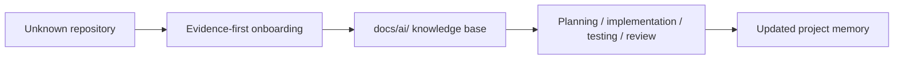

# AI Smart Superpowers for Onboarding Manual

<!-- translation-status: ai-translated; ai-quality-pass -->

> Translation status: AI-translated from the English source; AI quality gate passed; no human review required.
> Source language: English
> Source file: ai/English/README.md
> Bei Abweichungen ist die englische Datei maßgeblich.

## Overview

AI Smart Superpowers for Onboarding ist ein evidence-first Pre-Development Onboarding layer für AI coding agents. Der Standard macht Repository-Evidenz zu dauerhaftem `docs/ai/`-Kontext, bevor Ausführungs-Workflows starten.

## Purpose of this language folder

Dieser Sprachordner enthält das deutsch lokalisierte AI Manual für AI Smart Superpowers for Onboarding. Er gibt Menschen und KI-Coding-Agenten einen stabilen sprachspezifischen Einstieg, bevor Planung, Coding, Tests oder Reviews beginnen.

## Where This Fits

Nutze dieses Manual vor strukturierten Coding-Agent-Workflows, Superpowers-style Workflows oder Multi-Model-Setups. Superpowers-style beschreibt, wie ein Agent plant, implementiert, testet und reviewt; dieses Repository beschreibt, was ein Agent über ein konkretes Repository wissen sollte, bevor diese Workflows starten.

`Superpowers-style` is used descriptively and does not imply compatibility, endorsement or integration with `obra/superpowers`.

## Target Output

The standard creates or updates a reviewed `docs/ai/` knowledge base inside the target repository:

| File | Purpose |
|---|---|
| `PROJECT_MEMORY.md` | Continuity, handover notes, open tasks, assumptions, decisions and next steps. |
| `ARCHITECTURE.md` | Evidence-based architecture observations, boundaries and constraints. |
| `SECURITY_RULES.md` | Security boundaries, risk notes, redaction rules and sensitive-data handling. |
| `REVIEW_CHECKLIST.md` | Human and AI review checkpoints before work is trusted. |
| `CHANGELOG_AI.md` | Log of AI-assisted documentation changes and rationale. |

## Quickstart

1. Open [`templates/MASTER_PROMPT.en.md`](../../templates/MASTER_PROMPT.en.md).
2. Give it to your coding agent.
3. Point the agent at the target repository.
4. Review the proposed documentation plan.
5. Approve creation or update of `docs/ai/`.
6. Use `docs/ai/` as context for future AI-agent sessions.

## Source Of Truth And Links

| Area | Link |
|---|---|
| Primary master prompt | [`templates/MASTER_PROMPT.en.md`](../../templates/MASTER_PROMPT.en.md) |
| German workflow prompt | [`templates/MASTER_PROMPT.md`](../../templates/MASTER_PROMPT.md) |
| Target `docs/ai/` templates | [`templates/docs-ai/`](../../templates/docs-ai/) |
| Magical Prompt Improver manual page | [`prompts/magical-prompt-improver.md`](prompts/magical-prompt-improver.md) |
| Magical Prompt Improver source template | [`templates/optional/MAGICAL_PROMPT_IMPROVER.md`](../../templates/optional/MAGICAL_PROMPT_IMPROVER.md) |
| Canonical AI Manual source | [`ai/English/README.md`](../English/README.md) |

## Workflow

## When To Use

- Before asking an AI agent to modify an unfamiliar repository.
- Before a larger AI-assisted feature.
- Before multiple AI tools work on the same codebase.
- When project knowledge is scattered across files, issues or prior conversations.
- When architecture assumptions must be explicit.
- When security, review boundaries and traceability matter.
- When future AI sessions need reusable project memory.

## When Not To Use

- When you only need a short explanation.
- When the repository is already fully documented and current.
- When you want immediate code changes without documentation or review.
- When generated AI documentation cannot be reviewed by a human.
- When sensitive data cannot be safely inspected or summarized.

## English source of truth

Die englische Quelle [`ai/English/README.md`](../English/README.md) ist maßgeblich. Die deutsche Fassung spiegelt die englische Struktur und bewahrt Pfade, Dateinamen, Commands, APIs und Modellnamen.

## How to use this folder

Nutze diesen Ordner, wenn du die Manual-Struktur prüfst, Lokalisierung abgleichst oder wiederverwendbare Guidance für Prompts, Safety, Tools, Modelle, Workflows und Templates laden willst.

## Manual Structure

| Folder | Purpose |
|---|---|
| `agents/` | Agent patterns and operating models. |
| `commands/` | Command usage and CLI workflows. |
| `context-engineering/` | Context loading, pruning, retrieval and handoff. |
| `evals/` | Evaluation, benchmark and regression testing guidance. |
| `examples/` | Practical workflow examples. |
| `memory/` | Memory models, schemas and safety rules. |
| `models/` | Model-family specific notes. |
| `optimization/` | Prompt, workflow and skill optimization. |
| `prompts/` | Prompt templates and review prompts. |
| `providers/` | Provider-specific documentation. |
| `safety/` | Safety, privacy, approval and prompt-injection rules. |
| `skills/` | Skill design, lifecycle and transfer guidance. |
| `templates/` | Reusable templates. |
| `tools/` | Tool-specific guidance. |
| `workflows/` | Step-by-step onboarding, review, memory and translation workflows. |

## Recommended reading order

1. `README.md`
2. `prompts/magical-prompt-improver.md`
3. `prompts/README.md`
4. `workflows/repo-onboarding.md`
5. `safety/README.md`
6. `agents/README.md`
7. `context-engineering/README.md`
8. `tools/README.md`
9. `templates/README.md`

## Safety and human review rules

- Repository evidence is authoritative.
- Do not invent commands, model capabilities or provider behavior.
- Preserve file names, commands, API names and model names.
- Mark assumptions and unknowns.
- Escalate security, permissions and production-readiness risks to human review.
- Do not claim tests, release readiness, production readiness, compatibility or integration without evidence.

## Localization notes

- File names, folder names, commands, APIs and model names stay unchanged.
- Localized prose may be translated naturally.
- English wins when localized content conflicts with English.
- Keep these invariant terms visible across languages: `evidence-first`, `Pre-Development Onboarding layer`, `docs/ai/`, `Superpowers-style`, `Magical Prompt Improver`, `obra/superpowers`.

## Quality checklist

- [ ] Purpose is clear.
- [ ] Evidence-first Pre-Development Onboarding layer is visible.
- [ ] `docs/ai/` target output is linked and explained.
- [ ] Master Prompt, AI Manual and Magical Prompt Improver links are present.
- [ ] Superpowers-style wording is descriptive and makes no integration or compatibility claim.
- [ ] Use and Not-Use cases are visible.
- [ ] Manual structure is complete.
- [ ] All standard subfolders are listed, including `workflows/`.
- [ ] Safety boundaries are visible.
- [ ] No unsupported model/tool claims are added.
- [ ] English remains authoritative.
