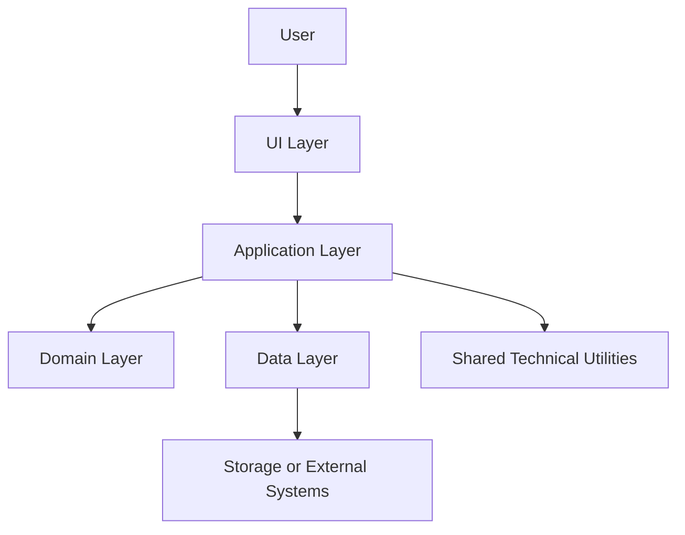
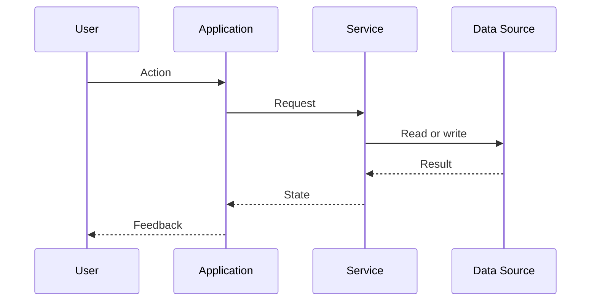

# ARCHITECTURE.md

**Last updated:** YYYY-MM-DD  
**Status:** DRAFT  
**Scope:** Architecture overview, system boundaries, data flow and known weaknesses.  
**Created/updated by:** AI Assistant (Model: [MODEL], Run-ID: [RUN-ID])  
***

## System type

`[UNKNOWN]`

Describe what the system is and what it is not.

## Technologies

| Area | Technology |
|---|---|
| Language | `[UNKNOWN]` |
| Framework | `[UNKNOWN]` |
| UI | `[UNKNOWN]` |
| Backend | `[UNKNOWN]` |
| Database | `[UNKNOWN]` |
| Tests | `[UNKNOWN]` |
| Build | `[UNKNOWN]` |
| Package manager | `[UNKNOWN]` |
| CI/CD | `[UNKNOWN]` |
| Deployment | `[UNKNOWN]` |

## Layer model

Text explanation:

`[UNKNOWN]`

## Folder responsibilities

| Folder | Responsibility | Must not contain |
|---|---|---|
| `[UNKNOWN]` | `[UNKNOWN]` | `[UNKNOWN]` |

## Routing / entrypoints

`[UNKNOWN]`

## Authentication and authorization

`[UNKNOWN]`

Do not infer production security from local or prototype mechanisms.

## Data flow

Text explanation:

`[UNKNOWN]`

## Critical paths

| Path | Files / modules | Risk |
|---|---|---|
| `[UNKNOWN]` | `[UNKNOWN]` | `[UNKNOWN]` |

## Technical decisions

- `[UNKNOWN]`

## Known weaknesses

- `[UNKNOWN]`
